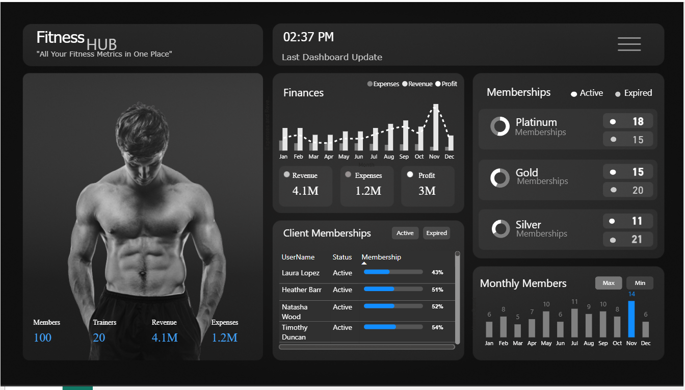

# 🏋️‍♂️ Fitness Hub Dashboard

A comprehensive **Power BI dashboard** to track and analyze key fitness center metrics including **finances, memberships, clients, and trainers**.  
This project integrates raw datasets with interactive visuals to provide insights into business performance and client engagement.

---

## 📌 Features

- **Home Page** → Quick snapshot of overall performance.
- **Overview Page** → Summary of members, trainers, revenue, and expenses.
- **Finances** → Revenue, expenses, and profit trends (monthly).
- **Memberships** → Active vs expired memberships (Platinum, Gold, Silver).
- **Client Memberships** → Track client activity, membership status, and usage.
- **Calculator** → Quick financial/statistical calculations.
- **Monthly Members** → Growth trends and seasonal analysis.

---

## 📊 Dataset

The dataset used (`Dataset.xlsx`) contains information such as:

| Column       | Description                          |
|--------------|--------------------------------------|
| **UserID**   | Unique identifier for each member     |
| **PaymentDate** | Date of membership payment         |
| **Amount**   | Payment amount (in local currency)    |
| **Mode**     | Payment method (Cash, Card, Online)   |

---

## 🖼️ Dashboard Preview


---

## 🛠️ Tools & Technologies

- **Power BI** → For building interactive dashboards
- **Excel** → Dataset management and preprocessing
- **DAX / Power Query** → Data modeling and calculations

---

## 📂 Project Structure
fitness-dashboard/
│
├── data/ # Raw datasets
│ └── Dataset.xlsx
│
├── dashboard/ # Power BI dashboard file(s)
│ └── gym_dashboard.pbix
│
├── assets/ # Preview images of dashboard
│ ├── homepage.png
│ ├── member.png
│ ├── .png
│ ├── calculator.png
│ └── menu.png
| └── DashBoard.png
|
├── docs/ # Documentation
│ └── dashboard_overview.md
│
└── README.md # Project documentation

---

## 🚀 How to Use

1. Clone the repository:
   ```bash
   git clone https://github.com/Rina-V09/fitness-dashboard.git
2.Open the Power BI file (gym_dashboard.pbix) in Power BI Desktop.
3.Explore different pages of the dashboard.
4.Load/refresh the dataset (Dataset.xlsx) if needed.

---

## 📌 Future Improvements

Add predictive analytics for membership growth.

Automate dataset refresh from an external database.

Deploy interactive reports via Power BI Service.

---

💡 Contributions, feedback, and suggestions are welcome!
